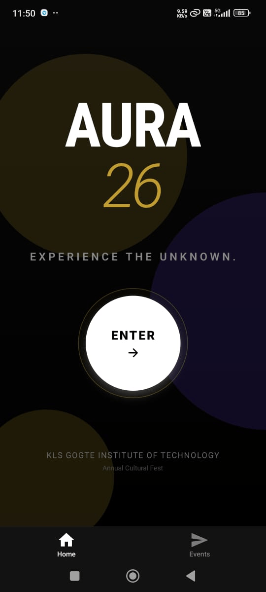

# Hello there!!!

This app was built as a task for getting selected in Aura Tech Team of KLS GIT.

v1.0.0 for android has been released [download the apk here](https://github.com/Rahul-Samedavar/Events-Manager/releases/tag/react-native)


## Features

1. **Event Cards** - Interactive 3D Card with realistic touch response.
2. **Event Pages** - Smart Markdown rendered Event Pages. Makes Event pages completely customizable and yet easy to create.
3. **Smart Notifications** - User can set notifications for any events. they can choose when to notify (1 Day before, 1 hour before, 30 mins before etc).
4. **Event Book marking** - User can book mark their favourite event to access them later easily.
5. **Dual Mode** - Light and Dark theme (system).
6. **Searchable Events** - Search bar with filters.
7. **Category Filtering** - Tech, Music, Workshop etc.

---

# Screenshots:





## Features Planned but couldnt be implemented due to Lab Exams!!
1. Fetching Events from Server and caching. And this is accompanied by event-update-id stored in the frontend. whenever new events are added or any modifications made this id gets updated in the server. so this allows our app to check for updates without any overload.

2. Share Bookmarks and Notifications through QR Code.


## get this project locally for dev

1. Clone this repo

   ```bash
   git clone https://github.com/Rahul-Samedavar/Events-Manager.git
   cd Events-Manager
   ```

2. Install dependencies

   ```bash
   npm install
   ```

3. Start the app

   ```bash
   npx expo start
   ```

4. Test

   - Web: press w to open web mode. use responsive mode(Android) from inspect tab.
   - Android / IOS physical: press c to get qr code. scan it from expo go app.
   - Virtual ANdroid Device: setup Android Studio SDK and Path and press a.
